<div align="center">

<!-- ═══════════════════════ HERO BANNER ═══════════════════════ -->


<!-- ═══════════════════════ TYPING ANIMATION ═══════════════════════ -->
[](https://git.io/typing-svg)

<br/>

<!-- ═══════════════════════ SOCIAL BADGES ═══════════════════════ -->
[](https://linkedin.com/in/ashrith-rai-k-604aa1362)
[](https://github.com/ashrithraik-ui)
[](https://leetcode.com/ashrith_rai_k)
[](https://www.naukri.com/code360/profile/ashrithraik)

</div>

<br/>

<!-- ═══════════════════════ IDENTITY CARD ═══════════════════════ -->
<div align="center">

</div>

<br/>

---

<!-- ═══════════════════════ ABOUT ME ═══════════════════════ -->

##  ABOUT ME

> *"The best way to predict the future is to build it."* — Alan Kay


I'm a **1st Year CSE student** at JSS Science & Technology University, Mysuru — passionate about building AI systems that actually matter. I live at the intersection of **machine learning, web development, and creative problem-solving**.

- 🤖 **AI/ML Enthusiast** — TF-IDF, cosine similarity, LLM pipelines, Anthropic API
- 🌐 **Full Stack Builder** — React, Node.js, HTML/CSS/JS — dark terminal UIs
- 🧠 **Currently Learning** — Deep Learning, Neural Networks, scikit-learn
- 💻 **Problem Solver** — Active on LeetCode & Code360, grinding DSA daily
- 🎮 **Creative Coder** — Built a custom Snake Game as a gift for my brother
- 🚀 **Portfolio Builder** — Fake Crime News Detector, Launchpad AI, Spotify Clone
- 📍 **Based in** — Mysuru, Karnataka, India
- 🎯 **Goal** — Become an impactful AI/ML engineer before I finish my degree

<br clear="right"/>

---

<!-- ═══════════════════════ CURRENTLY BUILDING ═══════════════════════ -->

## 🔭 CURRENTLY BUILDING

<div align="center">

<table>
<tr>
<td width="50%" valign="top">

### 🕵️ Fake Crime News Detector AI


> AI-powered system that detects fake or misleading crime news using NLP classification — built to fight misinformation with machine learning.


</td>
<td width="50%" valign="top">

### 🚀 Launchpad AI


> AI-powered launchpad that helps students and developers kickstart projects with smart suggestions, tech stack picks, and learning roadmaps.


</td>
</tr>
<tr>
<td width="50%" valign="top">

### 🎵 Spotify Clone


> Full-featured music player clone iterated in both React and pure HTML/CSS/JS. Focus on UI fidelity and responsiveness.


</td>
<td width="50%" valign="top">

### 🐍 Custom Snake Game


> Personalized Snake game built as a gift for my younger brother. Custom themes, speed levels, and surprise elements — because off-the-shelf is boring.


</td>
</tr>
</table>

</div>

---

<!-- ═══════════════════════ CONTRIBUTION CONSTELLATION ═══════════════════════ -->

## ✨ CONTRIBUTION CONSTELLATION

<div align="center">

</div>

---

<!-- ═══════════════════════ GITHUB STATS ═══════════════════════ -->

## 📊 GITHUB STATS

<div align="center">


<br/><br/>


<br/><br/>


<br/>


</div>

---

<!-- ═══════════════════════ TROPHIES ═══════════════════════ -->

## 🏆 TROPHY CASE

<div align="center">

</div>

---

<!-- ═══════════════════════ TECH STACK ═══════════════════════ -->

## ⚙️ TECH ARSENAL

<details open>
<summary><b>🧬 Languages</b></summary>
<br/>


</details>

<details open>
<summary><b>🤖 AI · ML · Data</b></summary>
<br/>


</details>

<details open>
<summary><b>🖥️ Frontend & Web</b></summary>
<br/>


</details>

<details open>
<summary><b>🛠️ Tools & Platforms</b></summary>
<br/>


</details>

---

<!-- ═══════════════════════ CODING PROFILES ═══════════════════════ -->

## 🏅 CODING PROFILES

<div align="center">

[](https://leetcode.com/ashrith_rai_k)

</div>

---

<!-- ═══════════════════════ PYTHON WHOAMI ═══════════════════════ -->

## 🧠 ABOUT ME — `whoami`

```python
class AshrithRaik:
    def __init__(self):
        self.name         = "Ashrith Raik"
        self.university   = "JSS Science & Technology University, Mysuru"
        self.degree       = "B.E. Computer Science Engineering"
        self.year         = "1st Year"
        self.focus        = ["Artificial Intelligence", "Machine Learning", "Full Stack Dev"]
        self.building     = ["Fake Crime News Detector AI", "Launchpad AI", "Spotify Clone"]
        self.fun_fact     = "I built a custom Snake Game as a gift for my brother 🐍"
        self.goal         = "Engineer impactful AI systems before finishing my degree"

    def current_status(self):
        return "🟢 ONLINE — Learning · Building · Growing"

    def whoami(self):
        return f"{self.name} | {self.degree} @ {self.university}"
```

---

<!-- ═══════════════════════ LEARNING ROADMAP ═══════════════════════ -->

## 🗺️ AI/ML LEARNING ROADMAP

> *Tracking my journey from 1st year student → AI/ML Engineer — one milestone at a time.*

<div align="center">

| # | Phase | Domain | Topics | Status | Target |
|:-:|:------|:-------|:-------|:------:|:------:|
| 01 | 🌱 **Foundation** | Python | Core Python, OOP, File I/O, Libraries | ✅ Done | Sem 1 |
| 02 | 🌱 **Foundation** | Web Dev | HTML · CSS · JS · React · Node.js | ✅ Done | Sem 1 |
| 03 | 🌱 **Foundation** | DSA | Arrays, Strings, Recursion, Sorting | 🔄 Active | Sem 1–2 |
| 04 | 🌿 **Core ML** | Mathematics | Linear Algebra, Calculus, Probability, Stats | 🔄 Active | Sem 2 |
| 05 | 🌿 **Core ML** | ML Basics | Regression, Classification, Clustering, scikit-learn | 🔄 Active | Sem 2 |
| 06 | 🌿 **Core ML** | Data Skills | NumPy, Pandas, Matplotlib, EDA, Feature Eng | 🔄 Active | Sem 2 |
| 07 | 🌳 **Deep Learning** | Neural Networks | Perceptrons, Backprop, Optimizers — Keras/TF | 📅 Next | Sem 3 |
| 08 | 🌳 **Deep Learning** | CNNs | Image Classification, Object Detection, OpenCV | 📅 Next | Sem 3 |
| 09 | 🌳 **Deep Learning** | RNNs & LSTMs | Sequence Models, Time Series, Text Gen | 📅 Next | Sem 3 |
| 10 | 🚀 **Advanced AI** | NLP | Tokenization, Embeddings, Transformers, BERT | 📅 Planned | Sem 4 |
| 11 | 🚀 **Advanced AI** | LLMs & RAG | LangChain, Vector DBs, Agents, RAG Pipelines | 📅 Planned | Sem 4 |
| 12 | 🚀 **Advanced AI** | Generative AI | GANs, Diffusion Models, Prompt Engineering | 📅 Planned | Sem 4–5 |
| 13 | ☁️ **MLOps** | Deployment | FastAPI, Docker, Model Serving, REST APIs | 📅 Planned | Sem 5 |
| 14 | ☁️ **MLOps** | Cloud | AWS/GCP, SageMaker, Model Monitoring | 📅 Planned | Sem 5–6 |
| 15 | 🏆 **Compete** | Kaggle & Hackathons | Real datasets, leaderboards, real problems | 🔄 Active | Ongoing |
| 16 | 🤝 **Community** | Open Source | Contribute to ML/AI repos on GitHub | 🔄 Active | Ongoing |

</div>

<div align="center">

```
✅ Done  ·  🔄 Active  ·  📅 Planned
```

**Progress: `████████░░░░░░░░░░░░` ~35% of AI/ML roadmap complete**

</div>

---

<!-- ═══════════════════════ SYSTEM LOGS ═══════════════════════ -->

## ⚡ SYSTEM LOGS

<div align="center">

</div>

---

<!-- ═══════════════════════ DEV QUOTE ═══════════════════════ -->

<div align="center">


</div>

---

<!-- ═══════════════════════ FOOTER ═══════════════════════ -->

<div align="center">


<br/>

[](https://linkedin.com/in/ashrith-rai-k-604aa1362)
[](https://github.com/ashrithraik-ui)
[](https://leetcode.com/ashrith_rai_k)

<br/>


**`> SYSTEM ACTIVE · ALWAYS LEARNING · ALWAYS BUILDING`**

</div>

