<div align="center">

<!-- ANIMATED HEADER BANNER -->


</div>
<div align="center">
  
</div>

<div align="center">

<!-- SYSTEM ROLES TERMINAL BLOCK -->
```
> SYSTEM.ROLES
🤖  AI/ML Engineer  |  CSE Student @ JSS STU  |  Open Source Contributor
```

</div>

<br/>

<div align="center">

<!-- SOCIAL BUTTONS -->
[](https://linkedin.com/in/ashrith-rai-k-604aa1362)
[](https://github.com/ashrithraik-ui)
[](https://leetcode.com/ashrith_rai_k)
[](https://www.naukri.com/code360/profile/ashrithraik)

</div>

<br/>

---

<div align="center">

## `SYSTEM IDENTITY CARD // v1.0`

</div>

```bash
┌─────────────────────────────────────────────────────────────────┐
│                   SYSTEM IDENTITY CARD // v1.0                  │
│─────────────────────────────────────────────────────────────────│
│  NAME      Ashrith Raik                                         │
│  ROLE      AI/ML Engineer · CSE Student · Developer             │
│  STATUS    ██████████████████░░  BUILDING ●                     │
│  STACK     Python · TensorFlow · React · Node.js · Git          │
│  FOCUS     Machine Learning · Deep Learning · Web Dev           │
│─────────────────────────────────────────────────────────────────│
│  [ Python ]  [ TensorFlow ]  [ React ]  [ LangChain ]          │
│─────────────────────────────────────────────────────────────────│
│                  SYSTEM ACTIVE · UPTIME ∞                       │
└─────────────────────────────────────────────────────────────────┘
```

<br/>

---

## ✨ CONTRIBUTION CONSTELLATION

<div align="center">


</div>

---

## 📊 GITHUB STATS

<div align="center">


&nbsp;&nbsp;


</div>

<div align="center">


</div>

---

## 🧠 ABOUT ME

> *"The best way to predict the future is to build it."*

```python
class AshrithRaik:
    def __init__(self):
        self.name       = "Ashrith Raik"
        self.university = "JSS Science & Technology University, Mysuru"
        self.degree     = "B.E. Computer Science Engineering"
        self.year       = "1st Year"
        self.focus      = ["Artificial Intelligence", "Machine Learning", "Full Stack Dev"]
        self.building   = ["AI Resume Screener", "Portfolio", "Open Source Projects"]
        self.goal       = "Engineer impactful AI systems that solve real problems"

    def whoami(self):
        return f"{self.name} | {self.degree} @ {self.university}"
```

---

## ⚡ TECH STACK

<div align="center">

**Languages**


**AI / ML**


**Web & Tools**


</div>

---

## 🏆 CODING PROFILES

<div align="center">

[](https://leetcode.com/ashrith_rai_k)

</div>

---

<div align="center">


**`> SYSTEM ACTIVE · ALWAYS LEARNING · ALWAYS BUILDING`**


</div>
